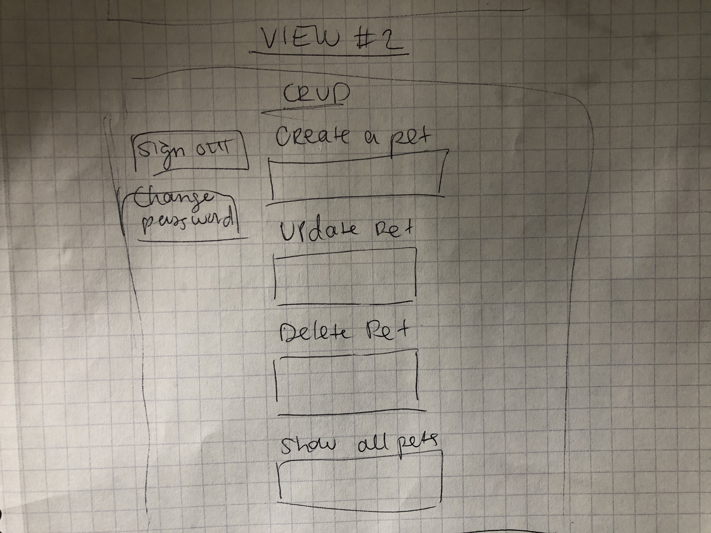

# Pet Collector

## Deployment link

## About
Pet Collector is an app that allows you to create custom pets and store them for future updates. Users can log their pet's name, type, and age. They can also view all of their pets, and update the details for each pet and remove any pet.

## User Stories
- I can sign up and confirm my sign up was successful
- I can sign in and confirm my sign in was successful
- I can sign out and confirm my sign out was successful
- I can change my password
- I can see all my pets at the same time with all of their attributes listed
- I have the option to update or delete any of my pets
- When I update a pet, I receive confirmation of the updated pet details and these are also reflected the next time I view all of my pets
- When I delete a pet, I receive confirmation they have been removed
- I can create a new pet and receive confirmation of my new pet details

## Wireframes

